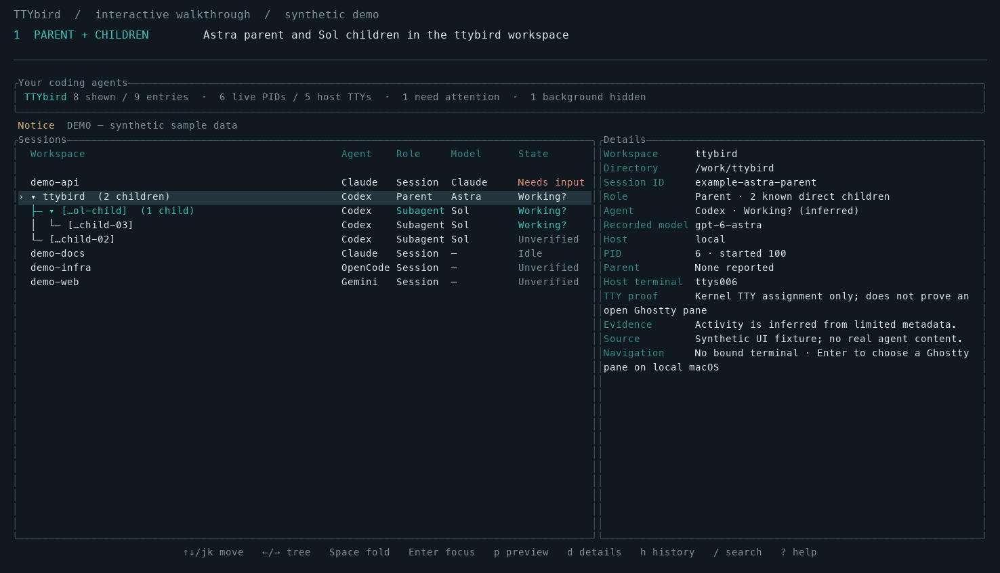

# TTYbird

散らばったAIエージェントを見つけ、元の端末へ戻るRust製TUIです。
いつもの起動方法を保ったまま、親子ツリー、検索、Ghostty/tmuxへの移動、
**libghostty-vt**による読み取り専用tmuxプレビューを追加します。
通常の一覧表示に常駐daemonやhooksは不要です。

**アルファ版です。** PIDの存在とモデルの作業中を区別します。
推定された状態と不明な状態を明示し、Ghosttyの初回紐付けは利用者が選択します。

[English / 詳しい操作](README.md) · [設計](docs/ARCHITECTURE.md) ·
[プロバイダー対応](docs/PROVIDERS.md) · [検証範囲](docs/VALIDATION.md)

次のウォークスルーでは親子ツリー、記録済みのタイトルとトークン情報を確認し、
`/`検索、`c`会話、`p`読み取り専用プレビュー、`d`根拠を開きます。最後に **Enter** で
そのセッションを開いていた端末へ戻ります。



実際のTTYbird操作とtmuxペイン移動を専用tmuxサーバーで収録しています。エージェントの
プロセス、セッション情報、会話は撮影用の合成データです。Ghostty GUIの移動映像ではなく、
モデルやAPIは呼び出しません。[収録条件](docs/demo-media.json)

## 起動

Homebrewからインストールできます（Apple SiliconのmacOS 14以降、またはglibc 2.39以降のx86_64 Linux）。

```sh
brew install ekusiadadus/tap/ttybird
ttybird --local
```

検証済みバイナリを取得するため、Rust・Zigのビルドは不要です。
tmux連携を使う場合は、tmuxを別途インストールしてください。

[Releases](https://github.com/ekusiadadus/ttybird/releases)から対象OSのアーカイブを取得し、展開します。
実行時にRust・Zig・Ghostty.appは不要です。`ps`とmacOSでは`lsof`、
各連携にはtmux/SSHが必要です。

```sh
./ttybird --local
```

セッションを選び **Enter**。紐付け済みtmuxペインへ移動するか、macOSでは
Ghosttyペインの選択画面を開きます。最初に対象ペインを選択すると、プロセスの
PID・起動時刻が一致する間は保存した対応付けを使います。
Ghostty連携にはGhostty 1.3以降のAppleScript機能が必要です。
Ghosttyへの移動後もTTYbirdは元のペインで動き続けます。戻って別のエージェントを
選択でき、`q`で終了します。

`p`を押すと、左にエージェント一覧、右に選択中のローカルtmuxペインの画面を
表示し、約2秒ごとに更新します。プレビューは読み取り専用です。入力するときは
Enterで元の端末へ移動してください。横幅105文字未満では上下表示になります。
通常のGhosttyタブには対応するライブ画面取得APIがないため、プレビューには
Ghostty内でtmuxを使ってエージェントを起動する必要があります。
macOSがAutomation権限を求めることがあります。

Nixでの固定ビルドと開発環境は[Nix](docs/NIX.md)を参照してください。
ソースビルドにはRust 1.90以上と **Zig 0.15.2** が必要です。

```sh
git clone https://github.com/ekusiadadus/ttybird.git
cd ttybird
cargo install --path . --locked
ttybird --local
```

## 内蔵端末（tmux不要）

```sh
ttybird run --name backend -- codex
ttybird run -- claude
ttybird run --detach --name review -- codex
ttybird sessions
ttybird attach SESSION_ID
ttybird stop SESSION_ID
```

左に一覧、右にTTYbird経由で起動した端末を表示します。Enterまたは`i`で
**INPUTモード**に入り、キー・Ctrl-C・貼り付けをプログラムへ送ります。
**Ctrl+]**で一覧に戻り、一覧側の`q`で画面だけ閉じます。プログラムは継続し、
`attach`で再接続できます。終了させるときは`stop`を使います。

セッションごとのバックグラウンドプロセスがPTYとlibghostty-vtの画面状態を
メモリに保持します。ディスクには識別用メタデータだけを保存し、画面内容や
コマンド引数は記録しません。ホスト再起動や保持プロセスの異常終了からの復元には
対応しません。複数画面で開くと最後のリサイズが共有PTYに反映されます。
マウス入力・端末内画像は未対応です。

起動済みの通常のGhosttyタブを取り込む機能ではありません。右側で表示・入力
したいセッションを`run`で新しく起動してください。

独立した端末を持たない子のEnterは、記録された親の端末へ移動します。
Ghosttyの初回紐付けは親に一度だけ行います。子自身の会話は`c`で確認できます。

## 主なキー

| キー | 操作 |
|---|---|
| ↑ / ↓、j / k | セッションを選択 |
| Space、← / → | 親子ツリーの折りたたみ・展開・移動 |
| Enter | 対応端末へ移動。独立した端末がない子は親の端末へ |
| Enter / i（TTYbird経由の端末） | 右ペインのINPUTモードへ |
| Ctrl+]（INPUTモード） | プログラムを止めず一覧へ戻る |
| p | ローカルtmuxのプレビュー。PageUp/PageDownで表示範囲を移動 |
| c | 直近のローカル会話を表示。Escで閉じる |
| d / / | 技術的な詳細 / タイトルなどを検索 |
| H | 引き継ぎ案を作成・確認してから新しいCodexセッションを開始 |
| N | 観測済みイベントの受信箱。`m`で確認済み、`z`で10分間スヌーズ |
| a | 観測できた入力待ちに絞る |
| b / h | 保持された子・バックグラウンドプロセス / 履歴を表示 |
| r / ? | 更新 / ヘルプ |
| q / Ctrl-C | 終了し、端末設定を復元 |

スクリプトには`--plain`、`--json`、`--watch --json`を使えます。
`ttybird doctor`で実行環境、`ttybird providers`で対応能力を確認できます。

対応するローカルCodexでは、稼働中のapp-serverへ読み取り専用で問い合わせて
`Working`・`Ready`（実行中のターンなし）・`Needs input`を表示します。
daemonやモデルは新規起動しません。取得できない場合の`Active log`・`Last reply`は
最後のログイベントを表し、`Unknown`は停止の断定ではありません。右側に情報源と
確認からの経過時間を表示します。詳しくは[状態判定](docs/LIVENESS.md)を参照してください。

## ワークスペース・通知・確認付き引き継ぎ

Git checkout内のセッションには、checkout/worktree、branchまたはdetached HEAD、
commit、dirty状態を表示します。Gitの調査は読み取り専用かつ時間・出力量を制限し、
任意lockを無効にします。変更内容のdiffは読まず、変更されたpathのmetadataだけを
扱います。同じrepositoryを共有するlinked worktreeも別のcheckoutとして表示します。

**N** で永続化されたattention inboxを開きます。対象は、任意のClaude hooksから
直接観測した権限・入力要求、応答終了、tool失敗だけです。通常の`PreToolUse`はtoolの
開始前のイベントなので、承認要求として扱いません。**m** で選択中の発生を確認済みにし、
**z** で通知を10分後に延期します。既読の発生は現在のdesktop通知を抑制し、後から
新しい観測が届けば別の発生として開きます。古い観測や到達不能なhostは「停止」と
断定せず、期限切れにします。明示的にスヌーズした場合は過去の観測に基づくreminderを
期限まで保持しますが、agentが今も待っているとは表示しません。CLIからも操作できます。

```sh
ttybird inbox
ttybird inbox ack EVENT_ID
ttybird inbox snooze EVENT_ID --minutes 10
```

desktop通知は既定で無効です。TUIまたはwatchに`--notify`を付けた場合だけ有効になり、
event種別と制御文字を除去して短くしたtask titleだけを表示します。会話本文は含めません。
配信は時間制限付きで、privateなconfig内の状態により重複を抑えます。要求の自動承認や
agentへの入力は行いません。「応答終了」は1回の応答の観測で、task完了の証明ではありません。

**H** で新しいTTYbird管理下のCodexセッションへ渡すdraftを作成・確認します。
準備時にmodelは呼び出しません。checkout情報と変更pathのmetadata、および明示的に
選んだnoteだけを含めます。直近会話の限定的な抜粋は指定した場合だけ追加します。
privateなdraftを確認・編集してから開始してください。CLIでは次のように操作します。

```sh
ttybird handoff prepare [SESSION] --cwd PATH --note RELATIVE_PATH --include-conversation
ttybird handoff start BUNDLE --yes --detach
```

`--yes`は確認したbundleそのものを開始する指定です。開始前にcheckout、branch、HEAD、
dirty状態、変更pathのmetadataを再確認し、既存のローカルCodex設定で起動します。
元のagentを停止したとは扱いません。

## タイトル・トークン・会話

一覧には記録された会話タイトルとトークン数を優先表示します。Codexは最新の累積値を使い、
同じ累積値を足しません。ClaudeはメッセージIDで重複を除いた取得範囲の合計なので、
`*`を付けます。欠測は推定値で埋めません。キャッシュ入力や推論出力は内数です。
子全体の合計・コンテキスト使用量・請求額ではありません。

`c`で、選んだローカルCodex/Claudeの直近3件までのユーザー・アシスタント本文を表示します。
プロセスとログの対応を再確認し、ツール引数・システム指示・推論は表示しません。
内容はメモリ内だけに保持し、閉じる・選択を変えると消去します。JSONやログには保存しません。会話は開いた時点の抜粋で、開き直すと更新します。
タイトルも個人情報になり得るため、JSONを共有する際は確認してください。

同じホスト・CLI・作業場所に会話セッションがある場合、補助的なProcess行は既定で隠し、
`b`で確認できます。同一セッションと断定してPID・TTY・移動先を統合する処理ではありません。

## 対応範囲と制約

- Codex/Claudeの状態はログの限定サンプルなどから取得します。他のCLIは
  原則プロセス情報のみで、作業状態は不明です。入力待ちの直接観測は現在、
  任意のClaude hooksに限られます。[対応表](docs/PROVIDERS.md)
- 親と子は同じPID・TTYを共有することがあります。端末移動はホスト端末へ
  戻る操作で、Codex内部のサブエージェント画面切替ではありません。
- `log only`は履歴で、既定では非表示です。ログが開かれているだけでは
  子が作業中とは判断しません。待機・終了・活動不明の子も既定では非表示にし、
  `b`で確認できます。[判定モデル](docs/LIVENESS.md)
- `Ghostty binding`は保存済みの移動先です。今も開いているパネルという意味ではなく、
  Enterで移動するときに存在を確認します。
- プレビューはローカルtmuxの可視画面を約2秒ごとに取得します。
  libghostty-vtで解析し、端末へエスケープ列を再送しません。
  取得内容はメモリ内のみで、入力送信・承認・ログ保存は行いません。
- libghostty-vtはGhostty.appの画面取得APIではありません。
  Ghostty単独やSSH先のプレビューは未対応です。Ghosttyへの移動には
  AppleScriptを使います。

[libghosttyの最新調査](docs/LIBGHOSTTY.md)では公開版・開発版・現在の実装を分けて説明しています。

SSHの登録、手動紐付け、任意hooks、開発コマンドは[英語README](README.md)を参照してください。
[全テストの監査](docs/TEST-AUDIT.md)には、削除・統合の判断と残した保証を記録しています。
不具合報告にはOS・端末・TTYbirdの版と匿名化した再現手順を添えてください。
実際の会話ログや認証情報を公開しないでください。ライセンスはMITです。

`Parent` は親子関係を表し、稼働中という意味ではありません。
表示対象の子が0件の親には展開矢印や件数を表示せず、Spaceも操作しません。
`b`で終了済みなどの子を表示したときは展開できます。記録された親子関係は詳細に残ります。

通常のGhosttyタブでは`p`を押しても空のプレビューへ切り替えません。
画面表示にはtmux、または新規セッションの`ttybird run -- codex`を使います。
Ghosttyへの移動が失敗する場合は`g`で正しいペインを選び直せます。
