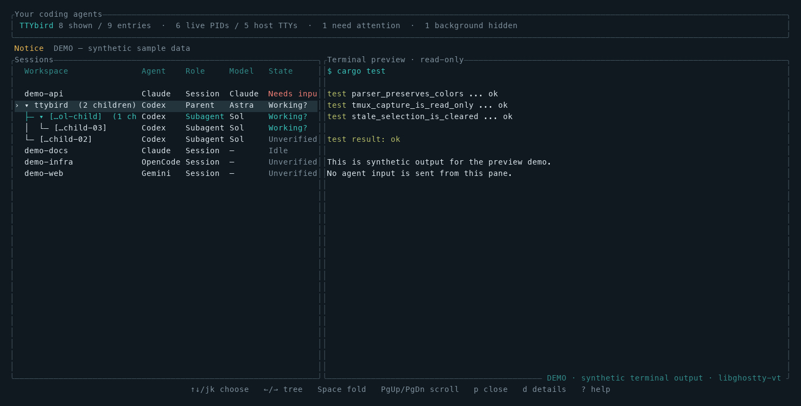

# TTYbird

Find your coding agents. Return to their terminals.

A Rust TUI that discovers existing coding-agent processes on macOS and Linux.
Keep your current launcher and terminal: TTYbird adds a searchable parent/child
view, explicit Ghostty/tmux navigation, and a read-only tmux preview powered by
**libghostty-vt**. Listing requires no daemon or hooks.

**Alpha.** A live PID is not proof that a model is working. Activity can be
inferred or unavailable; the UI shows that distinction. Ghostty pane mapping
requires your explicit choice the first time.

[日本語](README.ja.md) · [Architecture](docs/ARCHITECTURE.md) ·
[Provider coverage](docs/PROVIDERS.md) · [Tests and limits](docs/VALIDATION.md)


*Synthetic session data rendered by the actual TUI. The chooser in this demo
does not perform a real Ghostty focus operation.*

## Install and run

Download the archive for your platform from [Releases](https://github.com/ekusiadadus/ttybird/releases).
Alpha archives target Apple Silicon macOS 14+ and x86_64 Linux with glibc 2.39+
(Ubuntu 24.04+). Other targets require a source/Nix build.
The binary statically includes Ghostty's VT parser; Rust, Zig and Ghostty.app
are not required to run the collector. `ps` and, on macOS, `lsof` must be on
`PATH`; tmux/SSH are needed only for their respective integrations.

```sh
# Extract the downloaded archive, then:
./ttybird --local
```

Select a live session and press **Enter**. A mapped tmux pane opens directly;
an unmapped local session on macOS opens a **Ghostty pane chooser**. Choose the
matching pane yourself. Subsequent navigation uses that saved mapping while
its PID and start time still match. Ghostty 1.3+ and its AppleScript integration
are required for Ghostty navigation; macOS may request Automation permission.

Nix users can build the pinned package or enter the dev shell; see [Nix](docs/NIX.md).
For a source build, install Rust 1.90+ and **Zig 0.15.2**:

```sh
git clone https://github.com/ekusiadadus/ttybird.git
cd ttybird
cargo install --path . --locked
ttybird --local
```

The first source build downloads pinned Ghostty source and Zig dependencies.
The Rust binding is pinned to `libghostty-vt = 0.2.1`; Zig 0.16 is incompatible.

## Controls

| Key | Action |
|---|---|
| ↑ / ↓ or j / k | Select a session |
| Space / ← / → | Fold, expand, or navigate the parent/child tree |
| Enter | Return to its mapped terminal, or choose a Ghostty pane |
| p | Toggle local tmux preview; PageUp/PageDown scroll the captured screen |
| d | Full metadata and evidence |
| / | Search workspace, provider, host or session |
| a | Only observed requests needing input |
| b / h | Show background processes / recent log-only history |
| r / ? | Refresh / keyboard help |
| q / Ctrl-C | Exit and restore the terminal |

Piped output is plain text by default. Use `--plain`, `--json`, or
`--watch --json` (JSONL) explicitly for scripts. `ttybird doctor` checks runtime
tools and `ttybird providers` reports adapter capabilities.

## What is actually observed

- Process identity uses **PID + start time**. Session metadata supplies parent
  IDs and recorded models. A parent and child can share one process and TTY.
- Codex/Claude use bounded local log samples; only optional Claude hooks
  currently supply observed input notifications. Other supported CLIs expose
  process metadata, with unknown activity. See [the adapter matrix](docs/PROVIDERS.md).
- `log only` is history, hidden by default. Open logs do not prove that a child
  is currently running. [Liveness](docs/LIVENESS.md) explains the boundaries.
- Focus returns to the **hosting terminal**, not Codex's internal subagent view.
  TTYbird never infers a Ghostty binding from a working directory alone.

## libghostty-vt preview

Press `p` on a session in a local tmux pane. A worker reads the visible screen
using `tmux capture-pane`, parses it with Ghostty's VT engine, and renders owned
styled cells in Ratatui. It does not replay escape sequences to your terminal.
The VT handle stays on the capture worker; no non-Send handles cross threads.



The preview is opt-in, refreshes about every two seconds, and never sends input,
approves requests, changes tmux buffers, or saves pane contents. It checks the
process and pane identity before and after capture and discards stale results.
Commands have a two-second deadline and 1 MiB output bound; panes are limited to
500×200 cells. It shows a visible-screen snapshot, not continuous PTY output or
full scrollback. Wide previews are clipped to the available dashboard width.

**libghostty-vt does not extract screens from Ghostty.app.** Ghostty-only and SSH
previews are not implemented. Ghostty focus uses AppleScript; tmux navigation
uses the exact socket, pane and TTY. Supported rendering and limitations are
listed in [validation](docs/VALIDATION.md).

## SSH, explicit bindings and hooks

Install the same version on each remote host, using your existing SSH config:

```sh
ttybird hosts add lab --binary /home/me/.local/bin/ttybird
ttybird hosts list
ttybird focus EXACT_SESSION_ID --host lab
ttybird hosts remove lab
```

SSH collection uses BatchMode with an eight-second deadline, a 2 MiB output
limit and at most four concurrent hosts. Failure is shown as unavailable.
Remote focus opens an interactive SSH connection; raw TTYs cannot generally
be reattached without a persistent multiplexer.

Manual local binding:

```sh
ttybird terminals --json
ttybird bind EXACT_SESSION_ID --ghostty TERMINAL_UUID
ttybird bind EXACT_SESSION_ID --tmux %3 --socket work
```

`ttybird hooks` prints optional Claude hook configuration for manual integration
into your existing settings. It does not rewrite them. Hooks save allowlisted
lifecycle metadata, not prompts. See `ttybird --help` for CLI options.

## Privacy and development

Collection exports metadata, not prompts, tool arguments or raw command lines.
An explicit preview can contain sensitive pane text; it remains in memory and
is excluded from logs/JSON. Session IDs, directories and host names are personal
metadata: inspect exported snapshots before sharing them.

Run `cargo fmt --check`, `cargo clippy --locked --all-targets -- -D warnings`, and
`cargo test --locked`. [Validation](docs/VALIDATION.md) gives the private tmux/PTY
checks and current platform limits. [The test audit](docs/TEST-AUDIT.md) records
what was removed or consolidated and the practical regressions retained.

MIT licensed. Report reproducible issues with OS, TTYbird/terminal versions and
sanitized evidence; do not attach live transcripts or credentials.
