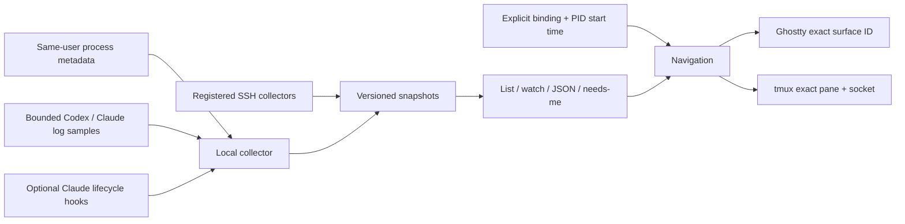

# Architecture

## Decision: observe existing sessions

TTYbird is a collector and navigation CLI. It does not own the agents' lifecycle. Rust provides one native executable for macOS/Linux, typed snapshots, bounded subprocess handling, and an SSH collector without a resident server or message broker.

## Evidence is part of the model

Every session includes provider, stable provider ID when available, explicit parent ID where present, host, optional PID/start timestamp, TTY, cwd, model, activity, confidence, evidence, observation timestamp, and optional navigation target. Unknown values remain optional, not invented defaults.

Process presence does not establish an active model turn. An open transcript proves a process has the file open, not that every retained thread is busy. Head/tail samples can omit transitions. Codex model metadata has a separate bounded 4 MiB lookback when the sampled tail has no model record; exhausted lookback produces an unknown model. Live writable-descriptor-owned logs remain eligible outside the recent-history cutoff, subject to the global file/walk limits. Hook states expire after five minutes. History without a live association remains `log only`.

Session IDs and tree links are scoped by host and provider in the aggregated view. The TUI traverses parent-child edges in depth-first order, guards cycles, and stores folds by stable session key. Folding only changes visibility; it does not interrupt agents. Search and attention filtering can reveal descendants. Clearing a filter restores the same selection or its closest visible ancestor where available. Navigation validates the current process identity. Ghostty bindings use exact surface UUIDs; working directory matching is deliberately insufficient. tmux uses socket and pane identity with TTY association. A child without its own terminal is not presented as having an independent shell.

## Interfaces

- `collect::collect`: local process/log snapshot.
- `telemetry`: opt-in Claude event ingestion and enrichment; only allowlisted metadata is persisted.
- `remote`: allowlisted SSH destination/binary syntax, fixed collector command, protocol validation, bounded process execution.
- `navigation`: Ghostty and tmux capabilities. No text/key injection API.
- `config`: private files, atomic writes, explicit host/binding management.
- CLI: filtering, presentation, bounded host concurrency, explicit focus.

Protocol 1 is JSON `Snapshot`. `collect` always returns one local snapshot. The user-facing list aggregates an array; watch emits successive arrays as JSONL. A remote collector with a different protocol version is rejected. Disconnection is represented by a warning and no authoritative claim about its agents.

## Primary contracts consulted

- [Ghostty AppleScript](https://ghostty.org/docs/features/applescript), plus the installed Ghostty 1.3.1 `Ghostty.sdef`.
- [Claude hooks reference](https://code.claude.com/docs/en/hooks). Hooks are optional and existing settings are never overwritten.
- [Codex App Server](https://learn.chatgpt.com/docs/app-server). Reviewed as a future adapter; not claimed as implemented.

Raw local transcript layouts are implementation details and may change. Their adapters must remain conservative and tested against synthetic format fixtures.

## Optional terminal preview

The `p` key enables a separate, bounded capture worker. It accepts only the selected local session, rechecks PID/start identity and process TTY, and resolves the exact tmux pane on the specified socket. `capture-pane -p -e -N` reads the visible screen to stdout without creating a tmux paste buffer. Pane identity, liveness, and dimensions are checked before/after capture; any failure clears the preview.

`src/preview.rs` owns a short-lived `libghostty-vt` terminal on that worker, converts tmux row delimiters to CRLF without scrolling the final row, and emits owned Ratatui text/styles. Raw terminal escapes are never replayed, and no terminal write/clipboard callbacks are installed. The UI rejects results for a different selection and does not derive agent activity from captured content. Closing preview clears its text and stops new requests; an already running bounded read may finish and is discarded.

The Rust binding and sys crate are fixed at 0.2.1. The sys crate pins Ghostty `a887df42c56f6de86c0fe6da9c4eeca37931e083`, whose build requires Zig 0.15.2 (0.16 is incompatible). The default static link makes the installed executable independent of an installed Ghostty app/library. The API remains pre-stable. Ghostty-only and SSH preview are intentionally reported as unavailable in this implementation.

## Coding CLI process registry

`src/providers.rs` recognizes 16 provider identities using exact native executable names and documented Node/Bun/Python script paths. It parses the interpreter's actual script position; arbitrary prompts and later arguments cannot identify a provider. A single absolute-path canonicalization handles npm/Homebrew symlink entrypoints. Relative paths are not resolved against the collector's cwd. Ambiguous names such as `agent`, `goose`, and `pi` require additional install/invocation evidence.

Only Codex/Claude opt into descriptor inspection and provider log sampling. Other providers contribute process metadata with unknown activity and no inferred model or parent session. The same explicit navigation and local tmux preview checks apply to every provider. The provider enum accepts unknown future values without inventing provider-specific capabilities. The CLI capability catalog and display labels use the shared provider definition.
