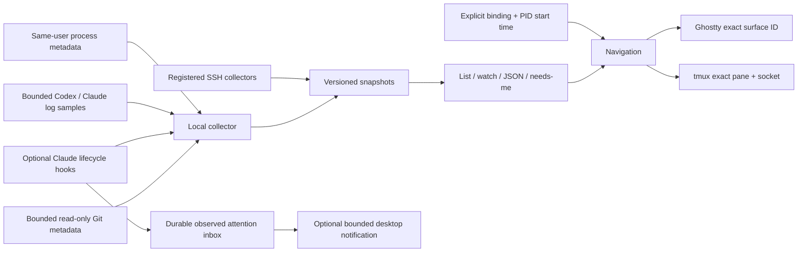

# Architecture

## Decision: observe existing sessions

TTYbird observes existing agents without owning their lifecycle. Rust provides one native executable for macOS/Linux, typed snapshots, bounded subprocess handling, and an SSH collector without a resident server or message broker. The separate, explicit `run` command opts into lifecycle ownership for a newly launched terminal.

## Optional owned terminals

`run` starts one detached helper and a new controlling PTY, then opens the
dashboard. The helper consumes PTY bytes into a persistent bounded libghostty-vt
engine, answers terminal queries, and waits on descriptors when idle. A private
Unix socket serializes screen, resize, key/paste and stop requests. Only process
identity metadata is written to disk. Screen snapshots stay in memory and never
enter ordinary collection JSON. Closing a dashboard drops its client; the helper
continues until the program exits or an explicit `stop` terminates its owned group.

The right pane shows the native VT engine's visible viewport. The TUI parses its
bounded ANSI snapshot into owned Ratatui cells, rather than writing untrusted raw
escape sequences to the host terminal. Input is available only after Enter/i on
a verified local `Managed` target. Ctrl+] returns to navigation, and focus loss
also disables input. Ordinary discovered Ghostty/tmux/remote sessions never gain
an input path. A child without its own terminal routes to its recorded parent;
the UI labels the parent destination before entering input mode.

This is local, text-only terminal support. It does not import a foreign PTY,
persist screen history across helper failures, support mouse/graphics, or provide
exclusive control among multiple human viewers; viewers share PTY geometry.

## Evidence is part of the model

Every session includes provider, stable provider ID when available, explicit parent ID where present, host, optional PID/start timestamp, TTY, cwd, model, activity, confidence, evidence, observation timestamp, and optional navigation target. Unknown values remain optional, not invented defaults.

Process presence does not establish an active model turn. An open transcript proves a process has the file open, not that every retained thread is busy. Head/tail samples can omit transitions. Codex model metadata has a separate bounded 4 MiB lookback when the sampled tail has no model record; exhausted lookback produces an unknown model. Live writable-descriptor-owned logs remain eligible outside the recent-history cutoff, subject to the global file/walk limits. Hook states expire after five minutes. History without a live association remains `log only`.

Session IDs and tree links are scoped by host and provider in the aggregated view. The TUI traverses parent-child edges in depth-first order, guards cycles, and stores folds by stable session key. Folding only changes visibility; it does not interrupt agents. Search and attention filtering can reveal folded descendants. Retained children with idle, ended or unknown activity remain hidden until `b` is enabled; filtering does not turn uncertain activity into a live-work claim. Clearing a filter restores the same selection or its closest visible ancestor where available. Navigation validates the current process identity. Ghostty bindings use exact surface UUIDs; working directory matching is deliberately insufficient. tmux uses socket and pane identity with TTY association. A child without its own terminal is not presented as having an independent shell.

## Interfaces

- `collect::collect`: local process/log snapshot.
- `telemetry`: opt-in Claude event ingestion and enrichment; only allowlisted metadata is persisted.
- `workspace`: bounded, read-only Git checkout/worktree identity, branch/HEAD and changed-path metadata; no diff content.
- `attention`: observed hook occurrences, read/acknowledge/snooze state and optional bounded notification delivery. It has no approval or agent-input path.
- `handoff`: private, user-reviewed context bundles and an explicit Codex launch after checkout identity is revalidated.
- `remote`: allowlisted SSH destination/binary syntax, fixed collector command, protocol validation, bounded process execution.
- `navigation`: Ghostty and tmux capabilities. No text/key injection API.
- `config`: private files, atomic writes, explicit host/binding management.
- CLI: filtering, presentation, bounded host concurrency, explicit focus.

Protocol 1 is JSON `Snapshot`. `collect` always returns one local snapshot. The user-facing list aggregates an array; watch emits successive arrays as JSONL. A remote collector with a different protocol version is rejected. Disconnection is represented by a warning and no authoritative claim about its agents.

## Primary contracts consulted

- [Ghostty AppleScript](https://ghostty.org/docs/features/applescript), plus the installed Ghostty 1.3.1 `Ghostty.sdef`.
- [Claude hooks reference](https://code.claude.com/docs/en/hooks). Hooks are optional and existing settings are never overwritten.
- [Codex App Server](https://learn.chatgpt.com/docs/app-server). Reviewed as a future adapter; not claimed as implemented.

Raw local transcript layouts are implementation details and may change. Their adapters must remain conservative and tested against synthetic format fixtures.

## Attention and reviewed handoff

Attention state is separate from the process/session snapshot. An occurrence is
keyed by host, provider, session, PID start identity and an occurrence counter.
Only observed Claude hook evidence on an exact allowlist can open an item:
permission/input requests, `Stop` as response-finished evidence, and tool
failure. `PreToolUse` / `WaitingTool` means ordinary tool execution and never
opens or notifies an approval item. Refreshing one sustained event does not
create another occurrence; a later observed event or a transition through work
does. Missing, stale or unreachable evidence expires without asserting that the
agent stopped or the task completed. An explicit snooze may retain a historical
reminder beyond evidence freshness, but its notification says that it is a
reminder of an observed request rather than a confirmed current wait.

Read, acknowledge, snooze and successful-notification state live in a private,
atomically replaced config file guarded across TTYbird processes. Notification
transports receive arguments directly without a shell, have a deadline and mark
an occurrence notified only after successful transport. Failure uses persistent
backoff. The payload is limited to provider/host, event type and a sanitized,
truncated task title; transcript text, cwd and hook evidence are not sent. No
attention action approves a tool call or writes to an agent terminal.

Handoff preparation is local and deterministic; it does not call a model.
Workspace identity and changed path metadata are included automatically. Note
files must be explicitly selected, remain inside the checkout and pass size and
credential-path restrictions. Conversation text is opt-in and bounded. The
editable draft and manifest are private files. Starting requires explicit review
confirmation, rechecks checkout/branch/HEAD plus dirty and changed-path
metadata, and launches a new owned Codex session with the user's existing Codex
defaults. The source session remains independent and is not treated as stopped.

## Optional terminal preview

The `p` key enables a separate, bounded capture worker. It accepts only the selected local session, rechecks PID/start identity and process TTY, and resolves the exact tmux pane on the specified socket. `capture-pane -p -e -N` reads the visible screen to stdout without creating a tmux paste buffer. Pane identity, liveness, and dimensions are checked before/after capture; any failure clears the preview.

`src/preview.rs` owns a short-lived `libghostty-vt` terminal on that worker, converts tmux row delimiters to CRLF without scrolling the final row, and emits owned Ratatui text/styles. Raw terminal escapes are never replayed, and no terminal write/clipboard callbacks are installed. The UI rejects results for a different selection and does not derive agent activity from captured content. Closing preview clears its text and stops new requests; an already running bounded read may finish and is discarded.

The Rust binding and sys crate are fixed at 0.2.1. The sys crate pins Ghostty `a887df42c56f6de86c0fe6da9c4eeca37931e083`, whose build requires Zig 0.15.2 (0.16 is incompatible). The default static link makes the installed executable independent of an installed Ghostty app/library. The API remains pre-stable. Ghostty-only and SSH preview are intentionally reported as unavailable in this implementation.

## Coding CLI process registry

`src/providers.rs` recognizes 16 provider identities using exact native executable names and documented Node/Bun/Python script paths. It parses the interpreter's actual script position; arbitrary prompts and later arguments cannot identify a provider. A single absolute-path canonicalization handles npm/Homebrew symlink entrypoints. Relative paths are not resolved against the collector's cwd. Ambiguous names such as `agent`, `goose`, and `pi` require additional install/invocation evidence.

Only Codex/Claude opt into descriptor inspection and provider log sampling. Other providers contribute process metadata with unknown activity and no inferred model or parent session. The same explicit navigation and local tmux preview checks apply to every provider. The provider enum accepts unknown future values without inventing provider-specific capabilities. The CLI capability catalog and display labels use the shared provider definition.

## Dashboard shutdown

The dashboard checks stdin/stdout hangup/error readiness before and after each
bounded input wait. Crossterm 0.28 uses its `use-dev-tty` Unix backend: the default
Mio backend can loop inside `read` forever after PTY EOF, preventing both its
poll timeout and the application termination flag from being checked. Switching
backends and checking hangup are both required; a pre-poll check alone races
closure during the wait. The dashboard redraws on input, resize and state updates,
not on every idle poll. PTY fixtures own a dedicated process group and clean it
on failure as well as success.
